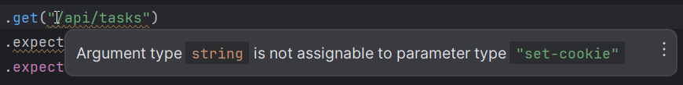
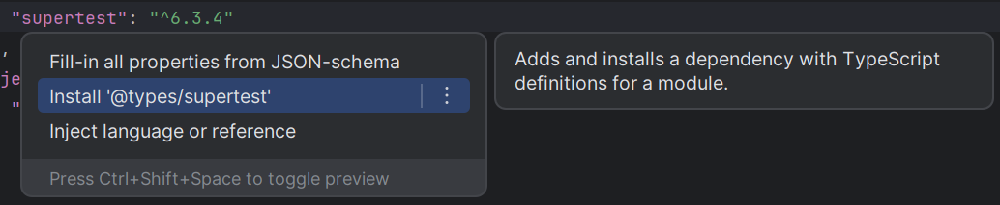
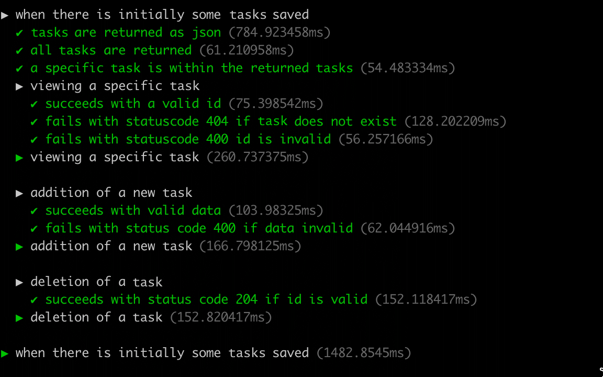

<div class="content">

We will now start writing tests for the backend.
Since the backend does not contain any complicated logic, it doesn't make sense to write [unit tests](https://en.wikipedia.org/wiki/Unit_testing) for it.
The only potential thing we could unit test is the `toJSON` method that is used for formatting tasks.

In some situations, it can be beneficial to implement some of the backend tests by mocking the database instead of using a real database.
One library that could be used for this is [mongodb-memory-server](https://github.com/nodkz/mongodb-memory-server).

Since our application's backend is still relatively simple,
we will decide to test the entire application through its REST API, so that it also tests the database at the same time.
This kind of testing where multiple components are combined and tested as a unit is called [**integration testing**](https://en.wikipedia.org/wiki/Integration_testing).

### Specifying Application modes

Your backend can have a variety of modes that it can be in.
For example, we mentioned that when your backend server is running in Render, it is in **production** mode.

The convention in Node is to define the execution mode of the application with the `NODE_ENV` environment variable.
In using Render, we were lucky enough that we were able to use the same *.env* file that we had in our development environment.
Other services only allow you to set variables manually through their site,
which means that the environment variables defined in the *.env* file would *only be loaded if the application is in **production mode***.

Because of tiny nuances like this, it is common practice to define separate modes for development and testing.

To do that, let's change the scripts in our *package.json* to include which mode we are in. For example when tests are run, `NODE_ENV` gets the value `test`:

```json
{
  //...
  "scripts": {
    // highlight-start
    "start": "NODE_ENV=production node index.js",
    "dev": "NODE_ENV=development node --watch index.js",
    "test": "NODE_ENV=test node --test",
    // highlight-end
    "build:ui": "rm -rf dist && cd ../reading/ && npm run build && cp -r dist ../backend-reading",
    "deploy": "npm run build:ui && git add . && git commit -m npm_generated_rebuild_of_the_UI && git push",
    "lint": "eslint .",
    "lint:fix": "npm run lint -- --fix"
  },
  //...
}
```

We specified the application mode (`NODE_ENV`) as:

- ***development*** in the `npm run dev` script.
- ***production*** in the default `npm start` command.

> **Windows Users:** There is a slight issue in how we have set up the application mode in our scripts: it will not work on Windows 😔.
> We can correct this by installing the [cross-env](https://www.npmjs.com/package/cross-env) package:
>
> ```bash
> npm i -D cross-env
> ```
>
> We can then achieve cross-platform compatibility by using the cross-env library in our npm scripts defined in *package.json*:
>
> ```json
> {
>   // ...
>   "scripts": {
>     "start": "cross-env NODE_ENV=production node index.js",
>     "dev": "cross-env NODE_ENV=development node --watch index.js",
>     "test": "cross-env NODE_ENV=test node --test",
>     // ...
>   },
>   // ...
> }
> ```
>
>> **Remember:**: If you are deploying this application to a cloud service,
>keep in mind that if cross-env is saved as a development dependency, it may cause an application error on your web server.
>To fix this, ***change cross-env to a production dependency*** by running this in the command line:
>>
>> ```bash
>> npm i -P cross-env
>> ```

#### Leveraging Application Modes in Code

Now we can modify the way that our application runs in different modes.
As an example of this, we could define the application to use a separate test database when it is running tests.

We can create our separate test database in MongoDB Atlas.
This is not an optimal solution in situations where many people are developing the same application.
Test execution in particular typically requires a single database instance that is not used by tests that are running concurrently.

It would be better to run our tests using a database that is installed and running on the developer's local machine.
The optimal solution would be to have every test execution use a separate database.
This is "relatively simple" to achieve by [running Mongo in-memory](https://docs.mongodb.com/manual/core/inmemory/) or by using [Docker](https://www.docker.com) containers.
Nonetheless, to reduce complexity at this point we will instead continue to use the MongoDB Atlas database.

Let's make some changes to the module that defines the application's configuration in *utils/config.js*:

```js
require('dotenv').config();

const PORT = process.env.PORT;

// highlight-start
const MONGODB_URI = process.env.NODE_ENV === "test"
  ? process.env.TEST_MONGODB_URI
  : process.env.MONGODB_URI;
// highlight-end

module.exports = {
  MONGODB_URI,
  PORT
};
```

The *.env* file has ***separate variables*** for the database addresses of the development and test databases:

```bash
MONGODB_URI=mongodb+srv://comp227:<password>@cluster0.gb6u3el.mongodb.net/taskApp?retryWrites=true&w=majority&appName=Cluster0
PORT=3001

// highlight-start
TEST_MONGODB_URI=mongodb+srv://comp227:<password>@cluster0.gb6u3el.mongodb.net/testTaskApp?retryWrites=true&w=majority&appName=Cluster0
// highlight-end
```

The *config* module that we have implemented slightly resembles the [*node-config* package](https://github.com/lorenwest/node-config).
Writing our implementation is justified since our application is simple, and also because it teaches us valuable lessons.

These are the only changes we need to make to our application's code.

You can find the code for our current application in its entirety in the *part4-2* branch of
[this GitHub repository](https://github.com/comp227/part3-tasks-backend/tree/part4-2).

### supertest

Let's use the [*supertest* package](https://github.com/visionmedia/supertest) to help us write our tests for testing the API.

We will install the package as a development dependency:

```bash
npm i -D supertest
```

Let's write our first test in the *tests/task_api.test.js* file:

```js
const { test, after } = require('node:test')
const mongoose = require("mongoose");
const supertest = require("supertest");
const app = require("../app");

const api = supertest(app);

test("tasks are returned as json", async () => {
  await api
    .get("/api/tasks")
    .expect(200)
    .expect("Content-Type", /application\/json/);
});

after(async () => {
  await mongoose.connection.close();
});
```

The test imports the Express application from the *app.js* module and wraps it with the `supertest` function
into a so-called [*superagent* object](https://github.com/visionmedia/superagent).
This object is assigned to the `api` variable and tests can use it for making HTTP requests to the backend.

Our test makes an HTTP GET request to the ***api/tasks*** URL and verifies that the request is responded to with the status code 200.
The test also verifies that the `Content-Type` header is set to *`application/json`*, indicating that the data is in the desired format.

Checking the value of the header uses a bit strange looking syntax:

```js
.expect("Content-Type", /application\/json/);
```

The desired value is now defined as a [regular expression](https://developer.mozilla.org/en-US/docs/Web/JavaScript/Guide/Regular_Expressions) or in short **regex**.
The regex starts and ends with a slash `/`, and because the desired string *`application/json`* also contains the same slash,
it is preceded by a *`\`* so that it is not interpreted as a regex termination character.

In principle, the test could also have been defined as a string

```js
.expect("Content-Type", "application/json");
```

The problem here, however, is that when using a string, the value of the header *must be exactly the same*.
For the regex we defined, it is acceptable that the header *contains* the string in question.
The actual value of the header is *`application/json; charset=utf-8`*, i.e. it also contains information about character encoding.
However, our test is not interested in this and therefore it is ***better to define the test as a regex instead of an exact string***.

> **FYI:** If you're not familiar with the RegEx syntax of `/application\/json/`,
you can learn more [via Mozilla's documentation](https://developer.mozilla.org/en-US/docs/Web/JavaScript/Guide/Regular_Expressions).
I would strongly encourage you all to practice working more with regular expressions!
If you're just plain rusty with regex and need practice, then there many sites that can help you test your regex as well, like [regex101](https://regex101.com/).

The test contains some details that we will explore [a bit later on](/part4/testing_the_backend#async-await).
The arrow function that defines the test is preceded by the **`async`** keyword
and the method call for the *`api`* object is preceded by the **`await`** keyword.
We will write a few tests and then take a closer look at *`async`*/*`await`*.
Do not concern yourself with them for now, just be assured that the example tests work correctly.
The *`async`*/*`await`* syntax is related to the fact that making a request to the API is an **asynchronous** operation.
This syntax can be used for writing asynchronous code with the appearance of synchronous code.

Once all the tests (*there is currently only one*) have finished running, we have to close the database connection used by Mongoose.
This can be achieved with the [`after` method](https://nodejs.org/api/test.html#afterfn-option):

```js
after(async () => {
  await mongoose.connection.close();
});
```

#### Dealing with some supertest warnings

At this point, you may end up noticing that WebStorm will flag some false positive warnings in your code.
Particularly you may see an error like this:



Your code still runs, but we want to prevent as many of these false positives from causing us to lose confidence in WebStorm's excellent warning system.

So to remove this, I'll show you how to do this from WebStorm.
Open *package.json* and locate the `supertest` dependency.
Then either right-click (or use your keyboard shortcut) to open up the context actions and select ***install @types/supertest*** option and you should be set.



For many of the libraries, we'll be able to download those types to have more information that WebStorm can provide us,
and I think it's prudent to install as many as they allow as *`devDependencies`*.

> **Pertinent**: at the [beginning](/part4/structure_of_backend_application_introduction_to_testing#project-structure)
of this part we extracted the Express application into the *app.js* file,
and the role of the *index.js* file was changed to launch the application at the specified port via `app.listen`:
>
> ```js
> const app = require("./app"); // the actual Express app
> const config = require('./utils/config')
> const logger = require('./utils/logger')
> // ...
> 
> app.listen(config.PORT, () => {
>   logger.info(`Server running on port ${config.PORT}`);
> });
> ```
>
> The tests only use the express application defined in the *app.js* file, which doesn't listen to any ports.
>
> ```js
> const mongoose = require("mongoose");
> const supertest = require("supertest");
> const app = require("../app"); // highlight-line
>
> const api = supertest(app); // highlight-line
>
> // ...
> ```
>
> The documentation for supertest says the following:
>
>> *if the server is not already listening for connections then it is bound to an ephemeral port for you so there is no need to keep track of ports.*
>
> In other words, ***supertest makes sure that the application being tested is started at the port that it uses internally***.
> This is one of the reasons why we are going with supertest instead of something like axios,
> as we do not need to run another instance of the server separately before beginning to test.
> The other reason is that supertest provides functions like `expect()`, which makes testing easier.

Let's write a few more tests:

```js
const assert = require('node:assert')
// ...

test("there are two tasks", async () => {
  const response = await api.get("/api/tasks");
  assert.strictEqual(response.body.length, 2)
});

test("a specific task is within the returned tasks", async () => {
  const response = await api.get("/api/tasks");
  const contents = response.body.map(e => e.content)
  assert.strictEqual(contents.includes("Wash the dishes"), true)
});
```

Both tests store the response of the request in the `response` variable,
and unlike the previous test that used the methods provided by *supertest* for verifying the status code and headers,
this time ***we are inspecting the response data stored in `response.body` property***.
Our tests verify the format and content of the response data with the
[`strictEqual` method](https://nodejs.org/docs/latest/api/assert.html#assertstrictequalactual-expected-message) of the *assert-library*.

We could simplify the second test a bit,
and use the [`assert`](https://nodejs.org/docs/latest/api/assert.html#assertokvalue-message) itself to verify that the task is among the returned ones:

```js
test('a specific task is within the returned tasks', async () => {
  const response = await api.get('/api/tasks')

  const contents = response.body.map(e => e.content)
  assert(contents.includes("Wash the dishes"))
})
```

The benefit of using the *`async`*/*`await`* syntax is starting to become evident.
Normally we would have to use callback functions to access the data returned by promises, but with the new syntax things are a lot more comfortable:

```js
const response = await api.get("/api/tasks");
// execution gets here only after the HTTP request is complete
// the result of HTTP request is saved in variable response
assert.strictEqual(response.body.length, 2)
```

The middleware that outputs information about the HTTP requests is obstructing the test execution output.
Let us modify *utils/logger.js* so that it does not print to the console in test mode:

```js
const info = (...params) => {
  // highlight-start
  if (process.env.NODE_ENV !== "test") { 
    console.log(...params);
  }
  // highlight-end
};

const error = (...params) => {
  // highlight-start
  if (process.env.NODE_ENV !== "test") { 
    console.error(...params);
  }
  // highlight-end  
};

module.exports = {
  info, error
};
```

### Initializing the database before tests

Currently, our tests have an issue where their success depends on the state of the database.
The tests pass if the test database happens to contain two tasks, one of which has the content `"Wash the dishes"`.
To make our tests more robust, we have to ***reset the database and generate the needed test data in a controlled manner before we run the tests***.

Our tests are already using the [`after` function](https://nodejs.org/api/test.html#afterfn-options)
to close the connection to the database after the tests are finished executing.
The library *node:test* offers many other functions
that can be used for executing operations once before any test is run or every time before a test is run.

In *task_api.test.js*, let's initialize the database **before every test** with the [`beforeEach` function](https://nodejs.org/api/test.html#beforeeachfn-options):

```js

const assert = require('node:assert')
const { test, after, beforeEach } = require('node:test') // highlight-line
const mongoose = require('mongoose')
const supertest = require('supertest')
const app = require('../app')
const Task = require('../models/task') // highlight-line

const api = supertest(app)

// highlight-start
const initialTasks = [
  {
    content: "Wash the dishes",
    date: new Date(),
    important: false,
  },
  {
    content: "Take out the trash",
    date: new Date(),
    important: true,
  },
];
// highlight-end

// highlight-start
beforeEach(async () => {
  await Task.deleteMany({});

  let taskObject = new Task(initialTasks[0]);
  await taskObject.save();

  taskObject = new Task(initialTasks[1]);
  await taskObject.save();
});
// highlight-end

// ...
```

The database is cleared out at the beginning, and after that, we save the two tasks stored in the `initialTasks` array to the database.
By doing this, *we ensure that the database is in the same state before every test is run*.

Let's modify the test that checks the number of tasks as follows:

```js
test("all tasks are returned", async () => { // highlight-line
  const response = await api.get("/api/tasks");
  assert.strictEqual(response.body.length, initialTasks.length) // highlight-line
})

// ...
```

### Running tests one by one

The `npm test` command executes all of the tests for the application.
When we are writing tests, it is usually wise to only execute one or two tests.
There are a few different ways of accomplishing this, one of which is the [**`only`** method](https://nodejs.org/api/test.html#testonlyname-options-fn).
With this method, we can define in the code what tests should be executed:

```js
test.only('tasks are returned as json', async () => {
  await api
    .get('/api/tasks')
    .expect(200)
    .expect('Content-Type', /application\/json/)
})

test.only('all tasks are returned', async () => {
  const response = await api.get('/api/tasks')

  assert.strictEqual(response.body.length, 2)
})
```

When tests are run with option *`--test-only`*, that is, with the command:

```bash
npm test -- --test-only
```

The functions marked as `test.only` are the ones npm executes.

The danger of `only` is that one forgets to remove those from the code.

A better option is to specify the tests that need to be run as parameters of the `npm test` command.

The following command only runs the tests found in the *tests/task_api.test.js* file:

```js
npm test -- tests/task_api.test.js
```

The [--tests-by-name-pattern](https://nodejs.org/api/test.html#filtering-tests-by-name) option can be used for running tests with a specific name:

```js
npm test -- --test-name-pattern="a specific task is within the returned tasks"
```

The provided argument can refer to the name of the test or the `describe` block.
***The parameter can also contain just a part of the name.***
*The following command will run all of the tests that contain `tasks` in their name:*

```js
npm run test -- --test-name-pattern="tasks"
```

### async/await

Before we write more tests let's take a look at the `async` and `await` keywords.

The *`async`*/*`await`* syntax that was introduced in ES7 makes it possible to use *asynchronous functions that return a promise* in a way that makes the code look synchronous.

As an example, the fetching of tasks from the database with promises looks like this:

```js
Task.find({}).then(tasks => {
  console.log("operation returned the following tasks", tasks);
});
```

The `Task.find()` method returns a promise and we can access the result of the operation by registering a callback function with the `then` method.

All of the code we want to execute once the operation finishes is written in the callback function.
If we wanted to make several asynchronous function calls in sequence, the situation would soon become painful.
The asynchronous calls would have to be made in the callback.
This would likely lead to complicated code and could potentially give birth to a so-called [**callback hell**](http://callbackhell.com/).

By [chaining promises](https://javascript.info/promise-chaining) we could keep the situation somewhat under control,
and avoid callback hell by creating a fairly clean chain of `then` method calls.
We have seen a few of these during the course.
To illustrate this, you can view an artificial example of a function that *fetches all `tasks` and then deletes the first one*:

```js
Task.find({})
  .then(tasks => {
    return tasks[0].deleteOne();
  })
  .then(response => {
    console.log("the 1st task is removed");
    // more code here
  });
```

The `then` chain is alright, but we can do better.
The [**generator functions**](https://developer.mozilla.org/en-US/docs/Web/JavaScript/Reference/Global_Objects/Generator)
introduced in ES6 provided a [clever way](https://github.com/getify/You-Dont-Know-JS/blob/1st-ed/async%20%26%20performance/ch4.md#iterating-generators-asynchronously)
of writing asynchronous code in a way that "looks synchronous".
The syntax is a bit clunky and not widely used.

The `async` and `await` keywords introduced in ES7 bring the same functionality as the generators,
but in an understandable and syntactically cleaner way to the hands of all citizens of the JavaScript world.

We could fetch all of the tasks in the database by utilizing the [`await` operator](https://developer.mozilla.org/en-US/docs/Web/JavaScript/Reference/Operators/await) like this:

```js
const tasks = await Task.find({});
console.log("operation returned the following tasks", tasks);
```

***The code looks exactly like synchronous code***.
The execution of code pauses at `const tasks = await Task.find({})` and waits until the related promise is ***fulfilled***, and then continues its execution to the next line.
When the execution continues, the result of the operation that returned a promise is assigned to the `tasks` variable.

The slightly complicated example presented above could be implemented by using `await` like this:

```js
const tasks = await Task.find({});
const response = await tasks[0].deleteOne();

console.log("the 1st task is removed");
```

Let's see them side-by-side:

| .then | .now |
| :--- | :--- |
| <pre>Task.find({})<br/>  .then(tasks => {<br/>  })<br/>  .then(response => {<br/>    console.log("the 1st task is removed");<br/>    // more code here<br/>  });<br/> | <pre>const tasks = await Task.find({});<br/>const response = await tasks[0].remove();<br/><br>console.log("the 1st task is removed");<br/> |

Thanks to the new syntax, the *code is a lot simpler than the previous `then` chain*.

There are a few important details to pay attention to when using *`async`*/*`await`* syntax.
To use the `await` operator with asynchronous operations, they have to return a promise.
This is not a problem as such, as regular asynchronous functions using callbacks are easy to wrap around promises.

The `await` keyword can't be used just anywhere in JavaScript code.
Using `await` is possible only inside of an [`async` function](https://developer.mozilla.org/en-US/docs/Web/JavaScript/Reference/Statements/async_function).

This means that ***for the previous examples to work, they have to be using `async` functions***.
Notice the first line in the arrow function definition:

```js
const main = async () => { // highlight-line
  const tasks = await Task.find({});
  console.log("operation returned the following tasks", tasks);

  const response = await tasks[0].deleteOne();
  console.log("the first task is removed");
}

main(); // highlight-line
```

The code declares that the function assigned to `main` is asynchronous.
After this, the code calls the function with `main()`.

### async/await in the backend

Let's start to change the backend routes to `async` and `await`.

As all of the asynchronous operations are currently done inside of a function,
it is enough to change the route handler functions into `async` functions.

Let's start with the route in *controllers/tasks.js* for fetching all `tasks`:

```js
tasksRouter.get('/', (request, response) => {
  Task.find({}).then((tasks) => {
    response.json(tasks)
  })
})
```

that route gets changed to the following:

```js
tasksRouter.get("/", async (request, response) => { 
  const tasks = await Task.find({});
  response.json(tasks);
});
```

We can verify that our refactoring was successful by testing the endpoint through the browser and by running the tests that we wrote earlier.

You can find the code for our current application in its entirety in the *part4-3* branch of
[this GitHub repository](https://github.com/comp227/part3-tasks-backend/tree/part4-3).

### More tests and refactoring the backend

When code gets refactored, there is always the risk of [**regression**](https://en.wikipedia.org/wiki/Regression_testing),
meaning that *existing functionality may break*.

Let's refactor the remaining operations by first writing a test for each route of the API.
Start with the *add task* operation.

*Write a new test* in *task_api.test.js* that:

- adds a new task
- verifies that the number of tasks returned by the API increases
- verifies the newly added task is in the list.

```js
test("a valid task can be added", async () => {
  const newTask = {
    content: "async/await simplifies making async calls",
    important: true,
  };

  await api
    .post("/api/tasks")
    .send(newTask)
    .expect(201)
    .expect("Content-Type", /application\/json/);

  const response = await api.get("/api/tasks");

  const contents = response.body.map(r => r.content);

  assert.strictEqual(response.body.length, initialTasks.length + 1)

  assert(contents.includes('async/await simplifies making async calls'))
})
```

Our test fails because we accidentally returned the status code ***200 OK*** when a new task is created.
Let us change that to ***201 CREATED*** in *controllers/tasks.js*:

```js
tasksRouter.post("/", (request, response, next) => {
  const body = request.body;

  const task = new Task({
    content: body.content,
    important: Boolean(body.important) || false,
    date: new Date(),
  });

  task.save()
    .then(savedTask => {
      response.status(201).json(savedTask); // highlight-line
    })
    .catch(error => next(error));
});
```

Let's also add a test that verifies that a task without content will not be saved into the database.

```js
test("task without content is not added", async () => {
  const newTask = {
    important: true
  };

  await api
    .post("/api/tasks")
    .send(newTask)
    .expect(400);

  const response = await api.get("/api/tasks");

  assert.strictEqual(response.body.length, initialTasks.length)
})
```

Both tests check the state stored in the database after the saving operation, by fetching all the tasks of the application.

```js
const response = await api.get("/api/tasks");
```

The same verification steps will repeat in other tests later on, and it is a good idea to extract these steps into helper functions.
Let's add the function into a new file called *tests/test_helper.js* which is in the same directory as the test file.

```js
const Task = require("../models/task");

const initialTasks = [
  {
    content: "Wash the dishes",
    date: new Date(),
    important: false
  },
  {
    content: "Take out the trash",
    date: new Date(),
    important: true
  }
];

const nonExistingId = async () => {
  const task = new Task({ content: "willremovethissoon", date: new Date() });
  await task.save();
  await task.deleteOne();

  return task._id.toString();
};

const tasksInDb = async () => {
  const tasks = await Task.find({});
  return tasks.map(task => task.toJSON());
};

module.exports = {
  initialTasks, nonExistingId, tasksInDb
};
```

The module defines the `tasksInDb` function that can be used for checking the tasks stored in the database.
The `initialTasks` array containing the initial database state is also in the module.
We also define the `nonExistingId` function ahead of time,
which can be used for creating a database object ID that does not belong to any task object in the database.

Our *task_api.test.js* can now use the helper module and be changed like this:

```js
const assert = require('node:assert')
const { test, after, beforeEach } = require('node:test')
const mongoose = require("mongoose");
const supertest = require("supertest");
const app = require("../app");
const helper = require("./test_helper"); // highlight-line
const Task = require("../models/task");

const api = supertest(app)

beforeEach(async () => {
  await Task.deleteMany({});

  let taskObject = new Task(helper.initialTasks[0]); // highlight-line
  await taskObject.save();

  taskObject = new Task(helper.initialTasks[1]); // highlight-line
  await taskObject.save();
});

test("tasks are returned as json", async () => {
  await api
    .get("/api/tasks")
    .expect(200)
    .expect("Content-Type", /application\/json/);
});

test("all tasks are returned", async () => {
  const response = await api.get("/api/tasks");

  assert.strictEqual(response.body.length, helper.initialTasks.length) // highlight-line
})

test("a specific task is within the returned tasks", async () => {
  const response = await api.get("/api/tasks");

  const contents = response.body.map(r => r.content)
  assert(contents.includes("Take out the trash"))
})

test("a valid task can be added ", async () => {
  const newTask = {
    content: "async/await simplifies making async calls",
    important: true,
  };

  await api
    .post("/api/tasks")
    .send(newTask)
    .expect(201)
    .expect("Content-Type", /application\/json/);

  const tasksAtEnd = await helper.tasksInDb(); // highlight-line
  assert.strictEqual(tasksAtEnd.length, helper.initialTasks.length + 1) // highlight-line

  const contents = tasksAtEnd.map(t => t.content); // highlight-line
  assert(contents.includes("async/await simplifies making async calls"))
});

test("task without content is not added", async () => {
  const newTask = {
    important: true
  };

  await api
    .post("/api/tasks")
    .send(newTask)
    .expect(400);

  const tasksAtEnd = await helper.tasksInDb(); // highlight-line

  assert.strictEqual(tasksAtEnd.length, helper.initialTasks.length) // highlight-line
})

after(async () => {
  await mongoose.connection.close()
})
```

The code using promises works and the tests pass.
We are ready to refactor our code to use the *`async`*/*`await`* syntax.

Change the code in *controllers/tasks.js* that adds a new `task` changes from:

```js
tasksRouter.post('/', (request, response, next) => {
  const body = request.body

  const task = new Task({
    content: body.content,
    important: body.important || false,
    date: new Date(),
  })

  task
    .save()
    .then((savedTask) => {
      response.status(201).json(savedTask)
    })
    .catch((error) => next(error))
})
```

changes to:

```js
tasksRouter.post("/", async (request, response, next) => { // highlight-line
  const body = request.body

  const task = new Task({
    content: body.content,
    important: body.important || false,
    date: new Date(),
  })
  // highlight-start
  const savedTask = await task.save();
  response.status(201).json(savedTask);
  // highlight-end
})
```

You need to add the `async` keyword at the beginning of the handler to enable the use of `async`/`await` syntax.
The code becomes much simpler.

Notably, possible errors no longer need to be forwarded separately for handling.
In code using promises, a possible error was passed to the error-handling middleware like this:

```js
  task
    .save()
    .then((savedTask) => {
      response.json(savedTask)
    })
    .catch((error) => next(error)) // highlight-line
```

When using `async`/`await` syntax, Express will [automatically call](https://expressjs.com/en/guide/error-handling.html)
the error-handling middleware if an `await` statement throws an error or the awaited promise is rejected.
This makes the final code even cleaner.

> **FYI:** This feature is available starting from Express version 5.
> If you installed Express as a dependency before March 31, 2025, you might still be using version 4.
> You can check your project's Express version in the *package.json* file.
> If you have an older version, update to version 5 with the following command:
>
> ```bash
> npm install express@5 
> ```

### Refactoring the route responsible for fetching a single task

Next, let's write a test for viewing the details of a single task.
The code highlights the actual API operation being performed:

```js
test('a specific task can be viewed', async () => {
  const tasksAtStart = await helper.tasksInDb()
  const taskToView = tasksAtStart[0]

// highlight-start
  const resultTask = await api
    .get(`/api/tasks/${taskToView.id}`)
    .expect(200)
    .expect("Content-Type", /application\/json/);
// highlight-end

  assert.deepStrictEqual(resultTask.body, taskToView)
})
```

First, the test fetches a single task from the database.
Then, it checks that the specific task can be retrieved through the API.
Finally, it verifies that the content of the fetched task is as expected.

There is one point worth noting in the test.
Instead of the previously used [`strictEqual` method](https://nodejs.org/api/assert.html#assertstrictequalactual-expected-message),
the [`deepStrictEqual` method](https://nodejs.org/api/assert.html#assertdeepstrictequalactual-expected-message) is used:

```js
assert.deepStrictEqual(resultTask.body, taskToView)
```

The reason for this is that `strictEqual` uses the [`Object.is` method](https://developer.mozilla.org/en-US/docs/Web/JavaScript/Reference/Global_Objects/Object/is)
to compare similarity, i.e. it compares whether the objects are the same.
In our case, we want to check that the contents of the objects, i.e. the values of their fields, are the same.
For this purpose `deepStrictEqual` is suitable.

The tests pass and we can safely refactor the tested route to use `async`/`await`:

```js
tasksRouter.get('/:id', async (request, response) => {
  const task = await Task.findById(request.params.id)
  if (task) {
    response.json(task)
  } else {
    response.status(404).end();
  }
});
```

### Refactoring the route responsible for deleting a task

Let's also add a test for the route that handles deleting a task:

```js
test('a task can be deleted', async () => {
  const tasksAtStart = await helper.tasksInDb()
  const taskToDelete = tasksAtStart[0]

  await api
    .delete(`/api/tasks/${taskToDelete.id}`)
    .expect(204)

  const tasksAtEnd = await helper.tasksInDb()

  const contents = tasksAtEnd.map(n => n.content)
  assert(!contents.includes(taskToDelete.content))

  assert.strictEqual(tasksAtEnd.length, helper.initialTasks.length - 1)
})
```

The test is structured similarly to the one that checks viewing a single task.
First, a single task is fetched from the database, then its deletion via the API is tested.
Finally, it is verified that the task no longer exists in the database and that the total number of tasks has decreased by one.

The tests still pass, so we can safely proceed with refactoring the route:

```js
tasksRouter.delete('/:id', async (request, response) => {
  await Task.findByIdAndDelete(request.params.id)
  response.status(204).end()
})
```

You can find the code for our current application in its entirety in the *part4-4* branch of
[this GitHub repository](https://github.com/comp227/part3-tasks-backend/tree/part4-4).

### Optimizing the beforeEach function

Let's return to *task_api.test.js* and take a closer look at the `beforeEach` function that sets up the tests:

```js
beforeEach(async () => {
  await Task.deleteMany({});

  let taskObject = new Task(helper.initialTasks[0]);
  await taskObject.save();

  taskObject = new Task(helper.initialTasks[1]);
  await taskObject.save();
});
```

The function saves the first two tasks from the `helper.initialTasks` array into the database with two separate operations.
The solution is alright, but there's a more elegant way of saving multiple objects to the database:

```js
beforeEach(async () => {
  await Task.deleteMany({});
  console.log("cleared");

  helper.initialTasks.forEach(async (task) => {
    let taskObject = new Task(task);
    await taskObject.save();
    console.log("saved");
  });
  console.log("done");
});

test("tasks are returned as json", async () => {
  console.log("entered test");
  // ...
};
```

We save the tasks stored in the array into the database inside of a `forEach` loop.
The tests don't quite seem to work however.
*Imagine someone else added some console logs and wants your help to find the problem.*

The console displays the following output:

```shell
cleared
done
entered test
saved
saved
```

Despite our use of the `async`/`await` syntax, our solution does not work as we expected it to.
From the logs, we notice the test execution begins before the database is initialized!

The problem is that ***every iteration of the `forEach` loop generates an asynchronous operation***, and `beforeEach` won't wait for them to finish executing.
In other words, the `await` commands defined inside of the `forEach` loop are not in the `beforeEach` function, but in ***separate functions that `beforeEach` will not wait for***.
Additionally, [the `forEach` method expects a synchronous function as its parameter](https://developer.mozilla.org/en-US/docs/Web/JavaScript/Reference/Global_Objects/Array/forEach#description),
so the `async`/`await` structure does not work correctly within it.

Since the execution of tests begins immediately after `beforeEach` has finished executing,
the execution of tests begins before the database state is initialized.

One way of fixing this is to wait for all of the asynchronous operations to finish executing with the
[`Promise.all` method](https://developer.mozilla.org/en-US/docs/Web/JavaScript/Reference/Global_Objects/Promise/all):

```js
beforeEach(async () => {
  await Task.deleteMany({})

  const taskObjects = helper.initialTasks
    .map(task => new Task(task))
  const promiseArray = taskObjects.map(task => task.save())
  await Promise.all(promiseArray)
})
```

The solution is quite advanced despite its compact appearance.
The `taskObjects` variable is assigned to an array of Mongoose objects that are created with the `Task` constructor for each of the tasks in the `helper.initialTasks` array.
The next line of code creates a new array that **consists of promises**,
that are created by calling the `save` method of each item in the `taskObjects` array.
In other words, it is an array of promises for saving each of the items to the database.

The [`Promise.all` method](https://developer.mozilla.org/en-US/docs/Web/JavaScript/Reference/Global_Objects/Promise/all)
can be used for transforming an array of promises into a single promise,
which will be ***fulfilled*** once every promise in the array passed to it as an argument is resolved.
The last line of code `await Promise.all(promiseArray)` waits until every promise for saving a task is finished, meaning that the database has been initialized.

> The returned values of each promise in the array can still be accessed when using the `Promise.all` method.
  If we wait for the promises to be resolved with the `await` syntax `const results = await Promise.all(promiseArray)`,
  the operation will return an array that contains the resolved values for each promise in the `promiseArray`,
  and they appear in the same order as the promises in the array.

`Promise.all` executes the promises it receives in parallel.
*If the promises need to be executed in a particular order, this will be problematic.*
In situations like this, the operations can be executed inside of a
[`for`...`of` block](https://developer.mozilla.org/en-US/docs/Web/JavaScript/Reference/Statements/for...of),
that guarantees a specific execution order.

```js
beforeEach(async () => {
  await Task.deleteMany({});

  for (const task of helper.initialTasks) {
    let taskObject = new Task(task);
    await taskObject.save();
  }
});
```

> **FYI:** Score another a point for the use of the IDE, if you started with our original `forEach` loop, WebStorm will flag this as a warning.
> It then provides you the option to change it automatically to use the `for`...`of` syntax we've just explained here.
> ***Make sure to look at the warnings!***

However, there is an even simpler way to implement the `beforeEach` function.
The easiest way to handle the situation is by utilizing Mongoose's built-in method `insertMany`:

```js
beforeEach(async () => {
  await Task.deleteMany({})
  await Task.insertMany(helper.initialTasks) // highlight-line
})
```

The code for our application can be found on
[GitHub](https://github.com/comp227/part3-tasks-backend/tree/part4-5), branch *part4-5*.

### Web developers pledge v4

We will once again update
[our web developer pledge](/part3/saving_data_to_mongo_db#web-developers-pledge-v3)
but will also add another item, since last time we pledged to check the database:

> I also pledge to:
>
> - *Check that my code works when one of my tests does not pass*

</div>

<div class="tasks">

### Exercises 4.8-4.12

**Warning:** If you find yourself ***using `async`/`await` and `then` methods*** in the same code, it is almost guaranteed that **you are doing something wrong**.
Use one or the other and don't mix the two.

#### 4.8: Watchlist tests, Step 1

Use the *supertest* library for writing a test that makes an **HTTP GET** request to the ***/api/show*** URL.
Verify that the watchlist application returns the correct amount of streaming shows in the JSON format.

Once the test is finished, refactor the route handler to use the *`async`*/*`await`* syntax instead of promises.

Notice that you will have to make similar changes to the code that were made
[in the material](#specifying-application-modes),
like defining the test environment so that you can write tests that use separate databases.

> **Pertinent:** when you are writing your tests ***it is better to not execute all of your tests***, only execute the ones you are working on.
> [Read more about this here](#running-tests-one-by-one).

#### 4.9*: Watchlist tests, Step 2

Write a test that verifies that the unique identifier property of the shows is named `id`, by default the database names the property `_id`.

Make the required changes to the code so that it passes the test.
The [`toJSON` method](/part3/saving_data_to_mongo_db#connecting-the-backend-to-a-database) discussed in part 3
is an appropriate place for defining the `id` parameter.

#### 4.10: Watchlist tests, Step 3

Write a test that verifies that making an **HTTP POST** request to the ***/api/shows*** URL successfully creates a new show onto the list.
At the very least, verify that the total number of shows in the system is increased by one.
You can also verify that the content of the show is saved correctly to the database.

Once the test is finished, refactor the operation to use *`async`*/*`await`* instead of promises.

#### 4.11*: Watchlist tests, Step 4

Write a test that verifies that if the `likes` property is missing from the request, it will default to the value *`0`*.
Do not test the other properties of the created shows yet.

Make the required changes to the code so that it passes the test.

#### 4.12*: Watchlist tests, Step 5

Write a test related to creating new shows via the ***/api/shows*** endpoint,
that verifies that if the `title` or `url` properties are missing from the request data,
the backend responds to the request with the status code **400 Bad Request**.

Make the required changes to the code so that it passes the test.

</div>

<div class="content">

### Refactoring tests

Our test coverage is currently lacking.
Some requests like ***GET /api/tasks/:id*** and ***DELETE /api/tasks/:id*** aren't tested when the request is sent with an invalid id.
The grouping and organization of tests could also use some improvement, as all tests exist on the same "top level" in the test file.
The readability of the test would improve if we group related tests with `describe` blocks.

Below is an example of *task_api.test.js* after making some minor improvements:

```js
const assert = require('node:assert')
const { test, after, beforeEach, describe } = require('node:test')
const mongoose = require('mongoose')
const supertest = require('supertest')
const app = require('../app')
const helper = require('./test_helper')
const Task = require('../models/task')

const api = supertest(app)

describe('when there is initially some tasks saved', () => {
  beforeEach(async () => {
    await Task.deleteMany({})
    await Task.insertMany(helper.initialTasks)
  })

  test('tasks are returned as json', async () => {
    await api
      .get("/api/tasks")
      .expect(200)
      .expect("Content-Type", /application\/json/);
  });

  test('all tasks are returned', async () => {
    const response = await api.get('/api/tasks')

    assert.strictEqual(response.body.length, helper.initialTasks.length)
  })

  test('a specific task is within the returned tasks', async () => {
    const response = await api.get('/api/tasks')

    const contents = response.body.map(e => e.content)
    assert(contents.includes('HTML is easy'))
  })

  describe('viewing a specific task', () => {
    test('succeeds with a valid id', async () => {
      const tasksAtStart = await helper.tasksInDb()
      const taskToView = tasksAtStart[0]

      const resultTask = await api
        .get(`/api/tasks/${taskToView.id}`)
        .expect(200)
        .expect('Content-Type', /application\/json/)

      assert.deepStrictEqual(resultTask.body, taskToView)
    })

    test('fails with status code 404 if task does not exist', async () => {
      const validNonexistingId = await helper.nonExistingId()

      await api.get(`/api/tasks/${validNonexistingId}`).expect(404)
    })

    test('fails with status code 400 id is invalid', async () => {
      const invalidId = '5a3d5da59070081a82a3445'

      await api.get(`/api/tasks/${invalidId}`).expect(400)
    })
  })

  describe('addition of a new task', () => {
    test('succeeds with valid data', async () => {
      const newTask = {
        content: 'async/await simplifies making async calls',
        important: true,
      }

      await api
        .post('/api/tasks')
        .send(newTask)
        .expect(201)
        .expect('Content-Type', /application\/json/)

      const tasksAtEnd = await helper.tasksInDb()
      assert.strictEqual(tasksAtEnd.length, helper.initialTasks.length + 1)

      const contents = tasksAtEnd.map(n => n.content)
      assert(contents.includes('async/await simplifies making async calls'))
    })

    test('fails with status code 400 if data invalid', async () => {
      const newTask = { important: true }

      await api.post('/api/tasks').send(newTask).expect(400)

      const tasksAtEnd = await helper.tasksInDb()

      assert.strictEqual(tasksAtEnd.length, helper.initialTasks.length)
    })
  })

  describe('deletion of a task', () => {
    test('succeeds with status code 204 if id is valid', async () => {
      const tasksAtStart = await helper.tasksInDb()
      const taskToDelete = tasksAtStart[0]

      await api.delete(`/api/tasks/${taskToDelete.id}`).expect(204)

      const tasksAtEnd = await helper.tasksInDb()

      const contents = tasksAtEnd.map(n => n.content)
      assert(!contents.includes(taskToDelete.content))

      assert.strictEqual(tasksAtEnd.length, helper.initialTasks.length - 1)
    })
  })
})

after(async () => {
  await mongoose.connection.close()
})
```

The test output in the console is grouped according to the `describe` blocks:



There is still room for improvement, but it is time to move forward.

This way of testing the API, by making HTTP requests and inspecting the database with Mongoose,
is by no means the only nor the best way of conducting API-level integration tests for server applications.
***There is no universal best way of writing tests***, as it all depends on the application being tested and available resources.

You can find the code for our current application in its entirety in the *part4-6* branch of
[this GitHub repository](https://github.com/comp227/part3-tasks-backend/tree/part4-6).

</div>

<div class="tasks">

### Exercises 4.13-4.14

#### 4.13 Watchlist expansions, Step 1

Implement functionality for deleting a single show.

Use the async/await syntax.
Follow [RESTful conventions](/part3/node_js_and_express#rest) when defining the HTTP API.

Implement tests for the functionality.

#### 4.14 Watchlist expansions, Step 2

Implement functionality for updating the information of an individual show.

Use `async`/`await`.

The application mostly needs to update the number of ***likes*** for a show.
You can implement this functionality the same way that we implemented updating tasks in [part 3](/part3/saving_data_to_mongo_db#other-operations).

Implement tests for the functionality.

</div>
